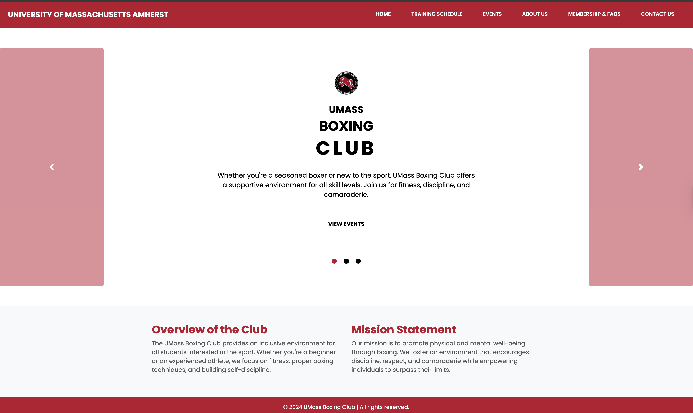
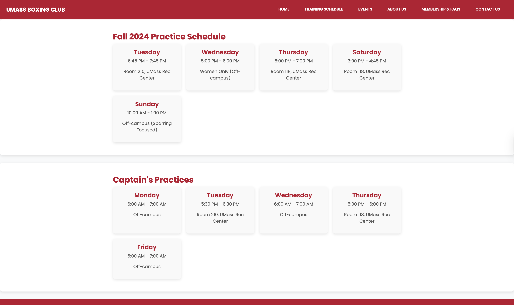
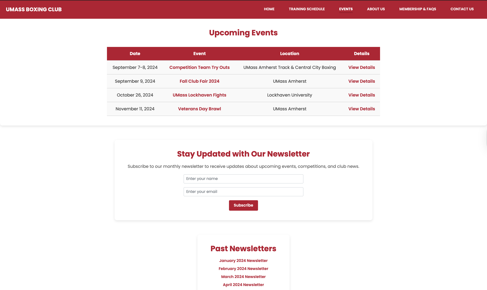
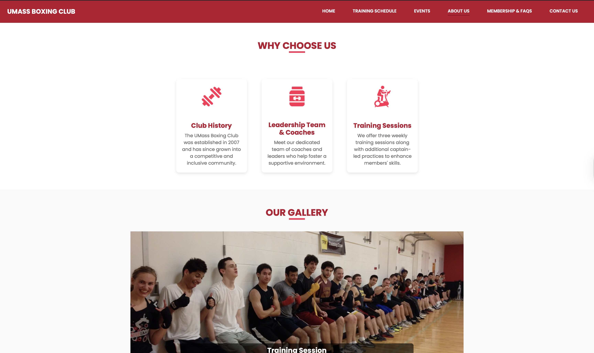
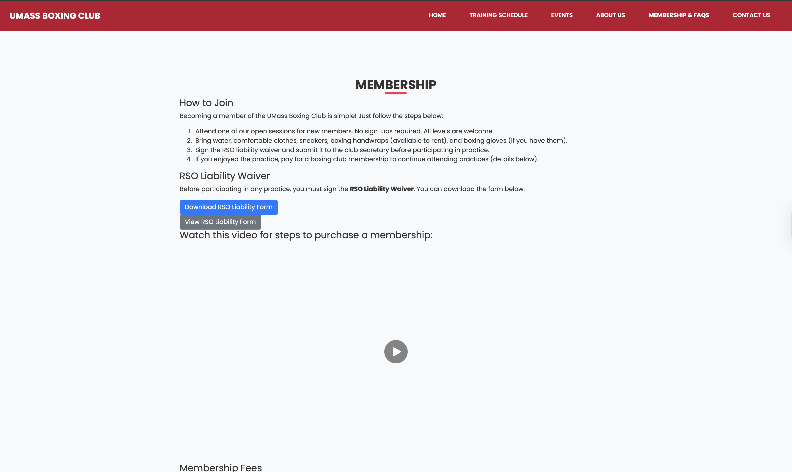
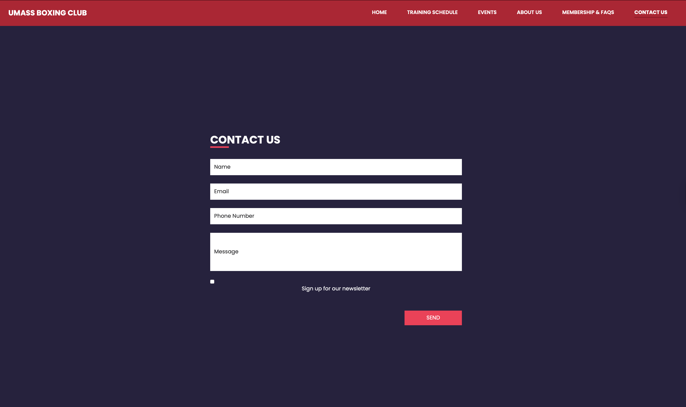

# 🥊 UMass Boxing Club Website

Official website of the **UMass Boxing Club**, built with modern web technologies and deployed on **Vercel**.  
The site provides details about events, training schedules, membership, and ways to contact the club.

---

## 📱 Demo

### Home


### Training Schedule


### Events


### About Us


### Membership & FAQs


### Contact Us


---

## 🚀 Installation & Usage

### 1. Clone the repository
```bash
git clone https://github.com/yourusername/umass-boxing-club.git
2. Open the project
Use your favorite code editor (VS Code recommended).

3. Install dependencies
If using npm for extra tooling:

bash

npm install
4. Run locally
bash

npm run dev
Then open http://localhost:3000 in your browser.

5. Hosting
This website is deployed on Vercel.
Push to the main branch to trigger automatic deployment.

🛠 Features
Home Page: Overview of the club and mission statement.

Training Schedule: Detailed weekly schedule for regular and captain's practices.

Events Page: List of upcoming events with dates and details.

About Us: Club history, leadership, and training philosophy.

Membership: Instructions on how to join, waiver forms, and membership fees.

Contact Us: Form to reach out and sign up for newsletters.

💻 Technologies
HTML

CSS

JavaScript

TypeScript

Hosted on Vercel

🤝 Contributing
Contributions welcome!
Feel free to fork and submit a pull request.

📄 License
MIT License. See LICENSE for details.

Built by Ron and Anshuman
